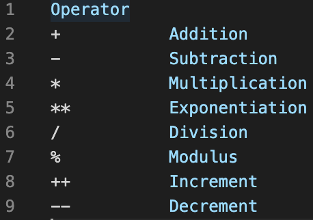
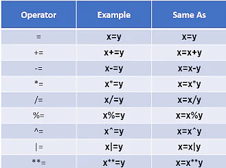

# JavaScript Arithmetic Operators

Various types of Arithmetic Operators in JS are given below :-

# JavaScript Assignment Operators

Various types of Assignment Operators in JS are given below:-

# JavaScript with Google Chrome Console

code is requested to see from consolejs1.js
