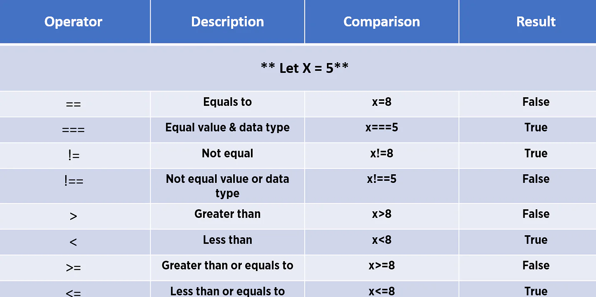

# Different types of Comparision Operators in JavaScript

There are different types of Comparision Operators in JavaScript which are given in bellow image with their example:-

# JavaScript If statement

Comparator Operators are used to fulfil the if statement
